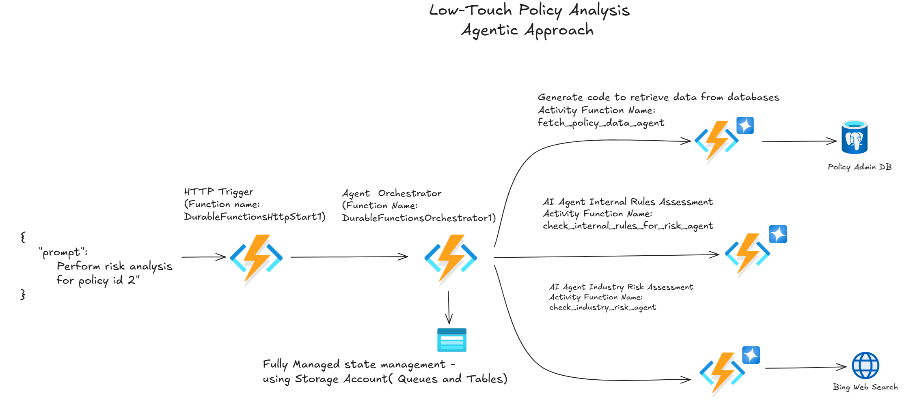
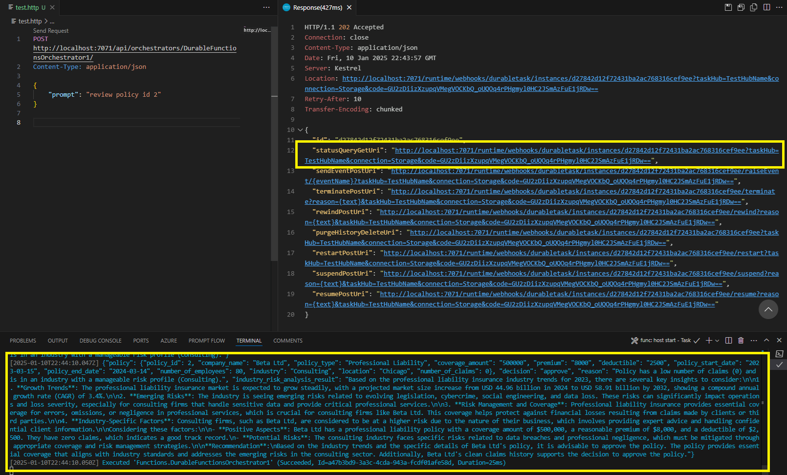
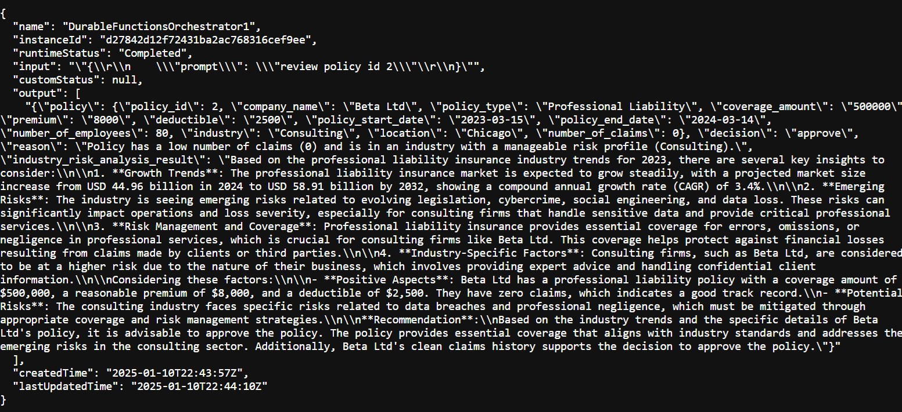

## Introduction

Durable Functions is an advanced serverless framework in Azure that enables reliable and scalable orchestration of workflows. Its ability to manage state, coordinate multiple tasks, and handle failures makes it an ideal choice for building AI-driven agentic workflows and automating business processes. By acting as the central orchestrator, Durable Functions seamlessly integrates various activity functions(AI agents), and external systems, ensuring the entire workflow operates smoothly and efficiently.

In scenarios such as insurance policy analysis, Durable Functions allow AI agents to perform tasks like natural language processing, rule-based evaluations, and risk assessments by leveraging tools like LLMs, search engines, and dynamic rule engines. Its capability to manage asynchronous workflows, maintain state across tasks, and integrate with other Azure services ensures scalability, fault tolerance, and operational efficiency, making it a perfect fit for modern AI-driven business applications.

## Key Benefits of Durable Functions in thsi context:
Orchestration of Tasks: The orchestrator function ensures that each step in the workflow (e.g., fetching policy data, analyzing risk, and evaluating industry trends) is executed in the correct sequence. This eliminates manual task coordination and ensures reliable execution.

State Management: Durable Functions automatically manage the state of the workflow, preserving progress even during failures or restarts. This ensures that partially completed workflows can resume seamlessly without losing data.

Result Passing: Results from each activity function are captured and passed to subsequent steps in the workflow. For example, policy data fetched by one activity is processed and used by other functions to assess internal and industry risks.

Scalability and Fault Tolerance: The orchestrator handles retries for failed activities, ensuring robustness and consistency in processing large volumes of policies.

Simplified Development: Using Durable Functions reduces the complexity of implementing workflows. Developers can focus on writing modular activity functions while the orchestrator handles coordination.

These are some of the essential functions required to build an agentic workflow. By leveraging Durable Functions, the orchestrator function enables seamless coordination between agents (activity functions), ensuring each agent performs its specific task in sequence, while also managing state, passing results, and handling retries or failures effectively. This structured approach lays the foundation for a reliable, scalable, and intelligent agentic workflow.

## Solution Overview

This project includes several Azure Functions that work together to analyze insurance policies for risk by performing analysis against a predefined rule set and conducting searches on the internet. Below is a brief overview of each function:

- **HTTP Trigger Function**: Triggered by an HTTP request. It reads the request payload, creates a `DurableOrchestrationClient`, and starts a new orchestration instance. The instance ID is logged and returned in the HTTP response.

- **Orchestrator Function**: Coordinates the execution of multiple activity functions. It retrieves input data, calls the activity functions in sequence, and processes their results. The orchestrator ensures reliable execution and maintains the correct workflow order.

- **fetch_policy_data_agent**: Interprets natural language queries, converts them into code (Python and SQL statements), and queries the database to retrieve policy information. This function uses the Azure OpenAI GPT-4 model to generate the code and execute it via a REPL code interpreter. Alternatively, you can use other code interpreters, such as OpenAI Assistant or Azure Container Apps dynamic sessions, to achieve similar functionality and to achieve this functionality.

- **check_internal_rules_for_risk_agent**: Evaluates the policy data against internal rules to assess associated risks. In this example, the rules are self-contained within the system prompt for simplicity. However, when operationalizing this solution, you may need to dynamically retrieve the rules from your rule engine to enhance flexibility and scalability.

- **check_industry_risk_agent**: Analyzes policy data based on industry trends and data to provide detailed risk analysis and recommendations. This analysis is performed by searching the internet and evaluating whether there are any risks in issuing the policy, considering the policy's industry classification in the context of current market trends. Additionally, this process augments the LLM's decision-making capabilities by incorporating data retrieved through a Bing search tool.



## Prerequisites

Before running this project, ensure you have the following prerequisites installed and configured:

1. **Python 3.10**: Ensure you have Python 3.10 installed on your machine. You can download it from [python.org](https://www.python.org/downloads/).

2. **Azure Functions Core Tools**: Install the Azure Functions Core Tools to run and debug Azure Functions locally. You can download it from [here](https://docs.microsoft.com/en-us/azure/azure-functions/functions-run-local).

3. **Azure CLI**: Install the Azure CLI to manage Azure resources from the command line. You can download it from [here](https://docs.microsoft.com/en-us/cli/azure/install-azure-cli).

4. **PostgreSQL**: Ensure you have access to a PostgreSQL database. Create the required table in a database called `pgdb` and populate it with sample data using the SQL statements provided below.

5. **Azure Storage Account**: Ensure you have an Azure Storage Account. Update the `AzureWebJobsStorage` setting in `local.settings.json` with your storage account connection string.

6. **Azure OpenAI Service**: Ensure you have access to Azure OpenAI Service. Update the `AZURE_OPENAI_KEY`, `AZURE_OPENAI_ENDPOINT`, `AZURE_OPENAI_DEPLOYMENT`, and `AZURE_OPENAI_VERSION` settings in `local.settings.json` with your OpenAI service details.

7. **Bing Search API**: Ensure you have access to the Bing Search API. Update the `BING_SUBSCRIPTION_KEY` and `BING_SEARCH_URL` settings in `local.settings.json` with your Bing Search API details.

### PostgreSQL Table Creation and Data Population

Create the `wholesale_casualty_insurance_policies` table in a database called `pgdb` and populate it with sample data using the following SQL statements:

```sql
CREATE DATABASE pgdb;

CREATE TABLE IF NOT EXISTS public.wholesale_casualty_insurance_policies
(
    policy_id integer NOT NULL DEFAULT nextval('wholesale_casualty_insurance_policies_policy_id_seq'::regclass),
    company_name character varying(255) COLLATE pg_catalog."default",
    policy_type character varying(255) COLLATE pg_catalog."default",
    coverage_amount numeric(15,2),
    premium numeric(15,2),
    deductible numeric(15,2),
    policy_start_date date,
    policy_end_date date,
    number_of_employees integer,
    industry character varying(255) COLLATE pg_catalog."default",
    location character varying(255) COLLATE pg_catalog."default",
    number_of_claims integer,
    CONSTRAINT wholesale_casualty_insurance_policies_pkey PRIMARY KEY (policy_id)
)
TABLESPACE pg_default;

ALTER TABLE public.wholesale_casualty_insurance_policies
    OWNER to pgadmin;

INSERT INTO public.wholesale_casualty_insurance_policies (policy_id, company_name, policy_type, coverage_amount, premium, deductible, policy_start_date, policy_end_date, number_of_employees, industry, location, number_of_claims) VALUES
(1, 'Acme Corp', 'General Liability', 1000000.00, 12000.00, 5000.00, '2023-01-01', '2023-12-31', 150, 'Manufacturing', 'New York', 2),
(2, 'Beta Ltd', 'Professional Liability', 500000.00, 8000.00, 2500.00, '2023-03-15', '2024-03-14', 80, 'Consulting', 'Chicago', 0),
(3, 'Gamma Inc', 'Product Liability', 2000000.00, 15000.00, 10000.00, '2023-06-01', '2024-05-31', 200, 'Retail', 'Los Angeles', 4),
(4, 'Delta Co', 'Workers'' Compensation', 750000.00, 10000.00, 1000.00, '2023-02-01', '2024-01-31', 120, 'Construction', 'Houston', 1),
(5, 'Epsilon LLC', 'General Liability', 1500000.00, 14000.00, 7500.00, '2023-08-01', '2024-07-31', 60, 'Transportation', 'Miami', 3),
(6, 'Zeta Enterprises', 'Professional Liability', 1000000.00, 11000.00, 5000.00, '2023-05-01', '2024-04-30', 50, 'IT Services', 'San Francisco', 5),
(7, 'Eta Partners', 'Product Liability', 1200000.00, 13000.00, 6000.00, '2023-09-01', '2024-08-31', 90, 'Food & Beverage', 'Seattle', 2),
(8, 'Theta Solutions', 'Workers'' Compensation', 500000.00, 7500.00, 2000.00, '2023-07-01', '2024-06-30', 110, 'Healthcare', 'Boston', 6),
(9, 'Iota Corp', 'General Liability', 1000000.00, 12500.00, 4000.00, '2023-10-01', '2024-09-30', 140, 'Finance', 'Philadelphia', 1),
(10, 'Kappa Inc', 'Professional Liability', 750000.00, 9000.00, 3000.00, '2023-04-01', '2024-03-31', 70, 'Legal Services', 'Denver', 7);
```

## Setup

1. **Clone the repository**:
   ```bash
   git clone <repository-url>
   cd <repository-directory>
   ```

2. **Create a virtual environment**:
    ```bash
    python -m venv .venv
    ```
3. **Activate the virtual environment**:

    **On Windows**:
    ```bash
    .venv\Scripts\activate
    ```
    **On macOS/Linux**:
    ```bash
    source .venv/bin/activate
    ```
4. **Install required packages**:
    ```bash
    pip install -r requirements.txt
    ```
5. **Run Azure Functions locally**:
    ```bash
    func start
    ```
    
## Execute Policy Analysis
    1.Open the test.http file in your editor.
    2.Send the HTTP request defined in the file to trigger the policy analysis function.
    3.View the results in the HTTP response or debug terminal.



## Sample Results
After executing the policy analysis, you will receive results like the following. Refer to the `output` attribute in the JSON for the analysis results:

```
{
  "name": "DurableFunctionsOrchestrator1",
  "instanceId": "d27842d12f72431ba2ac768316cef9ee",
  "runtimeStatus": "Completed",
  "input": "\"{\\r\\n    \\\"prompt\\\": \\\"review policy id 2\\\"\\r\\n}\"",
  "customStatus": null,
  "output": [
    "{\"policy\": {\"policy_id\": 2, \"company_name\": \"Beta Ltd\", \"policy_type\": \"Professional Liability\", \"coverage_amount\": \"500000\", \"premium\": \"8000\", \"deductible\": \"2500\", \"policy_start_date\": \"2023-03-15\", \"policy_end_date\": \"2024-03-14\", \"number_of_employees\": 80, \"industry\": \"Consulting\", \"location\": \"Chicago\", \"number_of_claims\": 0}, \"decision\": \"approve\", \"reason\": \"Policy has a low number of claims (0) and is in an industry with a manageable risk profile (Consulting).\", \"industry_risk_analysis_result\": \"Based on the professional liability insurance industry trends for 2023, there are several key insights to consider:\\n\\n1. **Growth Trends**: The professional liability insurance market is expected to grow steadily, with a projected market size increase from USD 44.96 billion in 2024 to USD 58.91 billion by 2032, showing a compound annual growth rate (CAGR) of 3.4%.\\n\\n2. **Emerging Risks**: The industry is seeing emerging risks related to evolving legislation, cybercrime, social engineering, and data loss. These risks can significantly impact operations and loss severity, especially for consulting firms that handle sensitive data and provide critical professional services.\\n\\n3. **Risk Management and Coverage**: Professional liability insurance provides essential coverage for errors, omissions, or negligence in professional services, which is crucial for consulting firms like Beta Ltd. This coverage helps protect against financial losses resulting from claims made by clients or third parties.\\n\\n4. **Industry-Specific Factors**: Consulting firms, such as Beta Ltd, are considered to be at a higher risk due to the nature of their business, which involves providing expert advice and handling confidential client information.\\n\\nConsidering these factors:\\n\\n- **Positive Aspects**: Beta Ltd has a professional liability policy with a coverage amount of $500,000, a reasonable premium of $8,000, and a deductible of $2,500. They have zero claims, which indicates a good track record.\\n- **Potential Risks**: The consulting industry faces specific risks related to data breaches and professional negligence, which must be mitigated through appropriate coverage and risk management strategies.\\n\\n**Recommendation**:\\nBased on the industry trends and the specific details of Beta Ltd's policy, it is advisable to approve the policy. The policy provides essential coverage that aligns with industry standards and addresses the emerging risks in the consulting sector. Additionally, Beta Ltd's clean claims history supports the decision to approve the policy.\"}"
  ],
  "createdTime": "2025-01-10T22:43:57Z",
  "lastUpdatedTime": "2025-01-10T22:44:10Z"
}
```


## Conclusion
Durable Functions provides the foundational framework needed to design and implement agentic workflows and business process automation. Its state management, task orchestration, and fault recovery capabilities allow developers to create complex workflows involving AI agents and external systems without worrying about the intricacies of execution and coordination. Whether for insurance policy analysis, risk assessment, or broader business automation, Durable Functions offers a reliable, scalable, and flexible solution that bridges the gap between AI intelligence and real-world operational requirements. By leveraging its strengths, organizations can achieve smarter, faster, and more resilient automated processes.